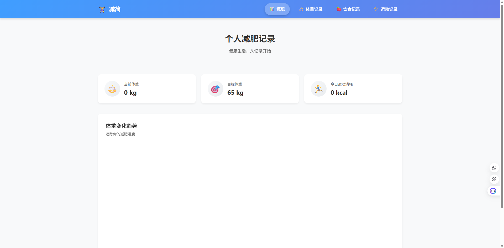
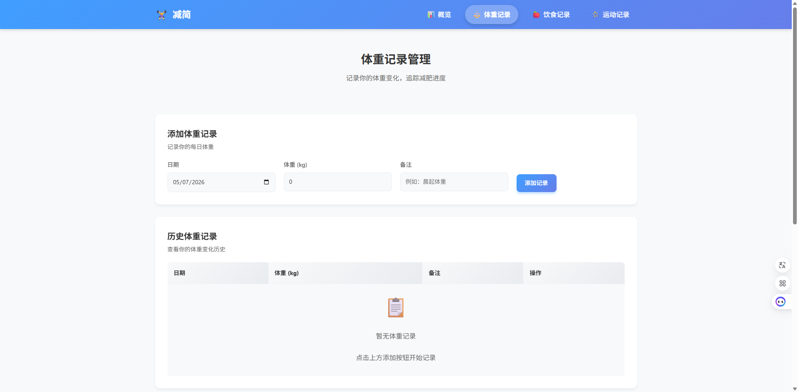
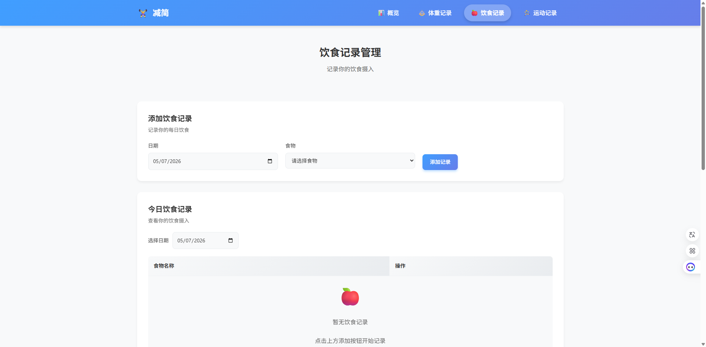
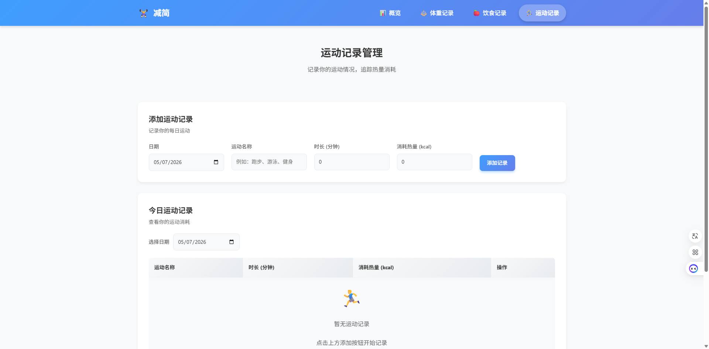

# 个人减肥记录网站

## 项目介绍

个人减肥记录网站是一个用于记录和管理个人减肥过程中体重变化、饮食摄入以及运动情况的网站。该网站提供了数据记录、统计分析和趋势图表等功能，帮助用户更好地了解减肥进度，从而更有效地管理饮食与运动习惯。

## 页面预览

### 数据概览



展示当前体重、目标体重、今日运动消耗等关键数据，并通过图表展示体重变化趋势。

### 体重记录



添加、查看、删除体重记录，支持按时间顺序展示。

### 饮食记录



添加、查看、删除饮食记录，支持选择预设食物或输入自定义食物名称。

### 运动记录



添加、查看、删除运动记录，统计每日运动消耗热量。

## 功能特点

- **数据概览**：展示当前体重、目标体重、今日运动消耗等关键数据，并通过图表展示体重变化趋势
- **体重记录管理**：添加、查看、删除体重记录，支持按时间顺序展示
- **饮食记录管理**：添加、查看、删除饮食记录，支持选择预设食物或输入自定义食物名称
- **运动记录管理**：添加、查看、删除运动记录，统计每日运动消耗热量
- **数据统计**：通过图表展示体重变化趋势，直观了解减肥进度

## 技术栈

- **前端**：Vue 3 + TypeScript + ECharts
- **后端**：FastAPI + SQLAlchemy + SQLite
- **部署**：Docker

## 项目结构

```
trim/
├── backend/          # 后端代码
│   ├── api/          # API 层
│   ├── conf/         # 配置文件
│   ├── middleware/   # 中间件
│   ├── repository/   # 数据访问层
│   ├── service/      # 业务逻辑层
│   ├── utils/        # 工具函数
│   ├── main.py       # 后端入口
│   └── requirements.txt  # 依赖文件
├── frontend/         # 前端代码
│   ├── public/       # 静态资源
│   ├── src/          # 源代码
│   │   ├── api/      # API 调用
│   │   ├── components/  # 组件
│   │   ├── router/   # 路由
│   │   ├── views/    # 页面
│   │   └── main.ts   # 前端入口
│   └── package.json  # 前端依赖
├── Dockerfile        # Docker 构建文件
└── README.md         # 项目说明
```

## 快速开始

### 1. 构建 Docker 镜像

```bash
docker build -t trim .
```

### 2. 运行 Docker 容器

```bash
docker run -d -p 8001:8001 --name trim trim:1.0
```

### 3. 访问应用

打开浏览器，访问 <http://localhost:8001>

## 本地开发

### 后端开发

1. 进入后端目录

```bash
cd backend
```

1. 安装依赖

```bash
pip install -r requirements.txt
```

1. 初始化数据库

```bash
python init_db.py
python init_food_data.py
```

1. 启动后端服务

```bash
python main.py
```

### 前端开发

1. 进入前端目录

```bash
cd frontend
```

1. 安装依赖

```bash
npm install
```

1. 启动前端开发服务器

```bash
npm run serve
```

1. 访问前端页面

打开浏览器，访问 <http://localhost:8080>

## API 文档

后端提供了以下 API 接口：

### 数据概览

- `GET /api/dashboard` - 获取首页统计数据
- `GET /api/dashboard/weight_trend` - 获取体重趋势数据

### 体重记录

- `GET /api/weight_record` - 获取体重记录列表
- `POST /api/weight_record` - 新增体重记录
- `DELETE /api/weight_record/{id}` - 删除体重记录

### 饮食记录

- `GET /api/food` - 获取食物列表
- `GET /api/food_record` - 获取饮食记录
- `POST /api/food_record` - 新增饮食记录
- `DELETE /api/food_record/{id}` - 删除饮食记录

### 运动记录

- `GET /api/exercise_record` - 获取运动记录
- `POST /api/exercise_record` - 新增运动记录
- `DELETE /api/exercise_record/{id}` - 删除运动记录

## 注意事项

- 本项目使用 SQLite 数据库，数据存储在 `backend/trim.db` 文件中
- 首次运行时会自动初始化数据库表结构和食物数据
- 前端构建文件会在 Docker 构建过程中自动生成并复制到后端

## 许可证

本项目采用 MIT 许可证。
